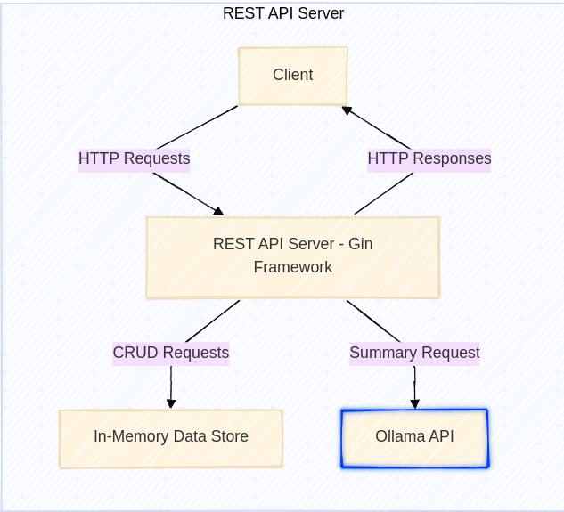
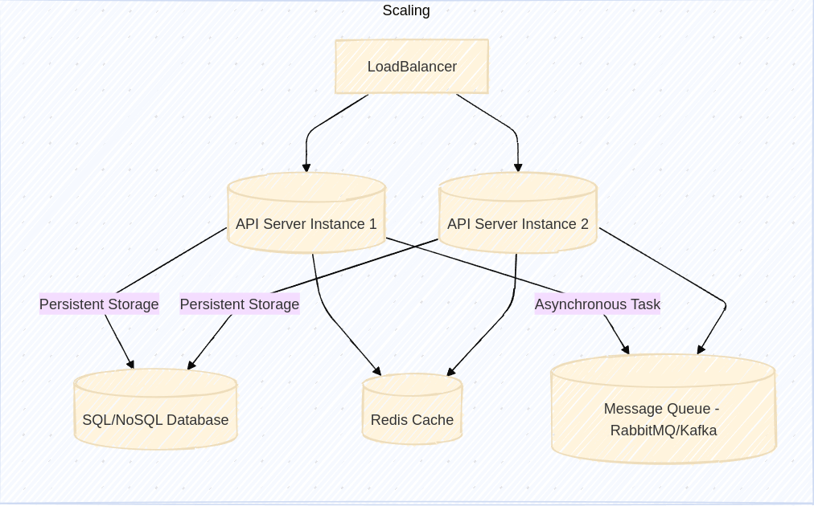

<h1 align='center'> Student Management REST API in Go <h1>

## Introduction
A simple REST API built in Go that enables basic CRUD (Create, Read, Update, Delete) operations on a list of students. Each student has the following attributes:

- **ID** (integer)
- **Name** (string)
- **Age** (integer)
- **Email** (string)

The API also integrates with [Ollama](https://www.ollama.com/) to generate AI-based summaries for individual students.

## Project Structure

```plaintext
├── main.go                    # Entry point of the application
├── server                     # Initializes the HTTP server
│   └── server.go
├── handler                    # Contains the CRUD handlers
│   └── handler.go
├── model                      # Defines the data structures for Student and Ollama requests
│   └── model.go
├── regex                      # Helper functions for regex validation
│   └── regex.go
└── Makefile                   # Defines commands for building and running the project
```


## API Endpoints

| Method | Endpoint               | Description                                |
|--------|------------------------|--------------------------------------------|
| POST   | /student               | Create a new student                       |
| GET    | /student/:id           | Retrieve student by ID                     |
| GET    | /students              | Retrieve all students                      |
| PUT    | /student/:id           | Update student by ID                       |
| DELETE | /student/:id           | Delete student by ID                       |
| GET    | /student/:id/summary   | Generate a summary for a student via Ollama API |


## Architecture

 </img>

## Pre-requisites 
You need to install Ollama cli in order to run the LLM model. It can be downloaded from <a href="https://www.ollama.com/"> here </a>
 Pull and run llama3 model
 ```bash
  ollama run llama3
   ```
It will start the llama3 model on http://localhost:11434 in your local machine

## Installation

To set up the project locally:

1. Clone the repository:
   ```bash
   git clone https://github.com/ItsOrganic/Fealltyx-Golang-Assignment.git && cd Fealltyx-Golang-Assignment
   ```
2. Install the dependencies:
   ```bash
   go mod tidy
   ```
3. Build and run the server:
   ```bash
   make run
   ```
### Using API Endpoints

You can import the Postman collection for testing. 
```plaintext
https://api.postman.com/collections/28479580-38eb4a0a-c146-4564-ad27-856d41ed6765?access_key=PMAT-01JC1PSJXYZE6RV78QK0PSJWDH
```
### How to Import Postman Collection:
1. Copy the link above to access the collection.
2. In Postman, click **Import** > **Paste the URL** to add it to your workspace.
3. Start testing the API!


## Suggestion for Scaling the Architecture

 </img>
